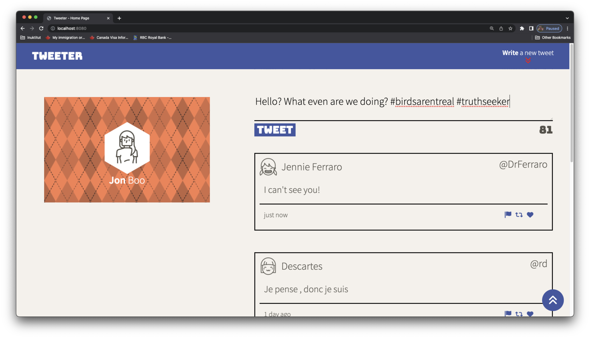
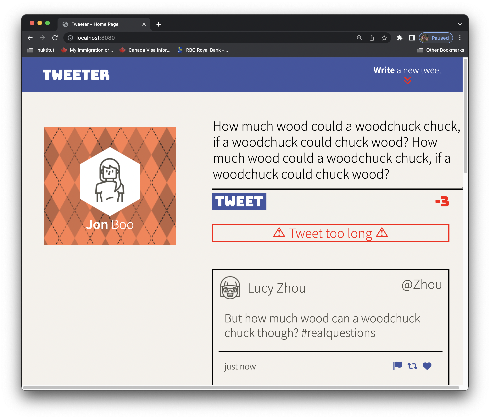
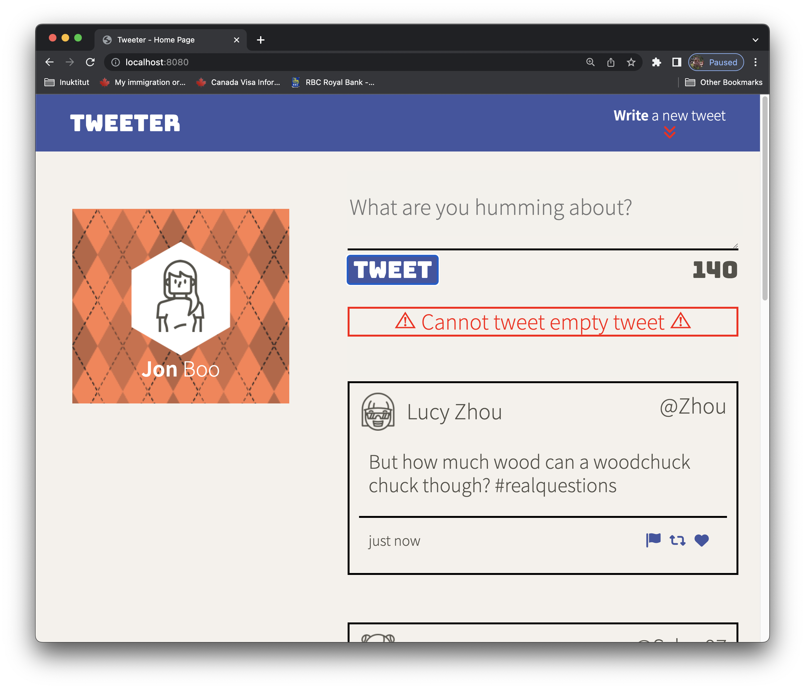
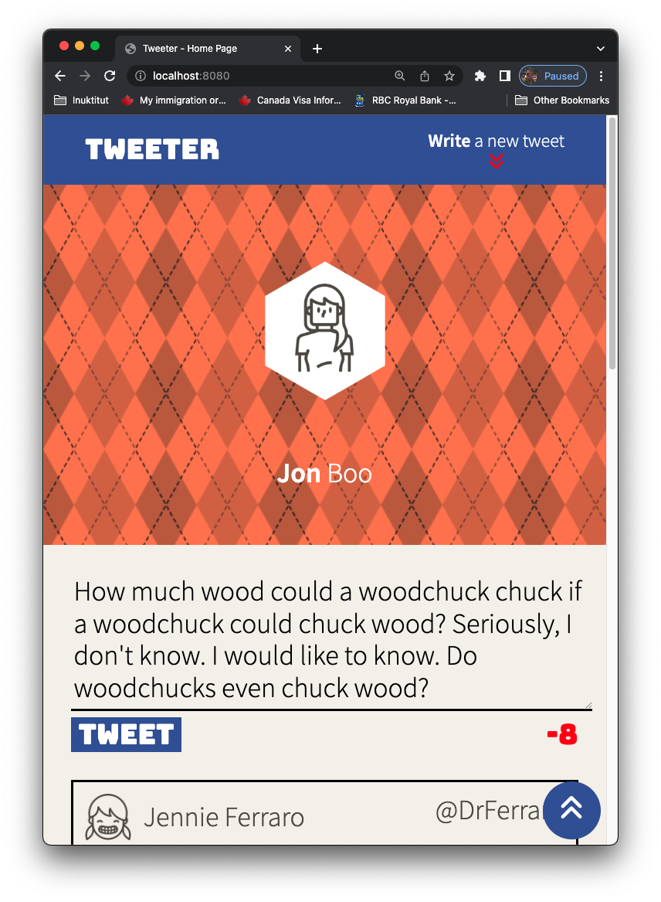
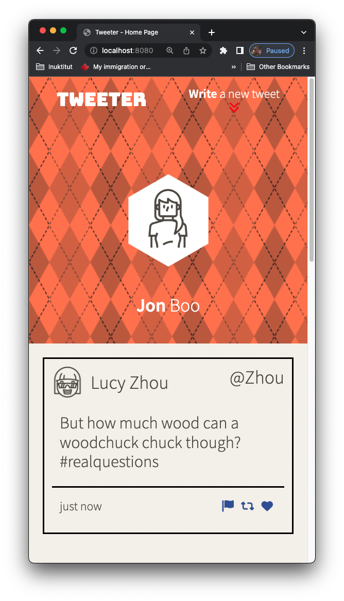
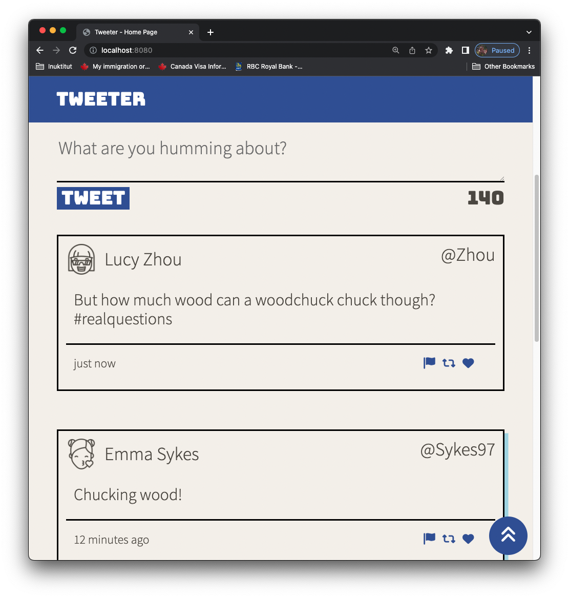

# Tweeter Project

Tweeter is a simple, single-page Twitter clone.

This project is designed to practice HTML, CSS, JS, jQuery and AJAX front-end skills, as well as Node and Express back-end skills.

This project does not have database functionality, instead using a simulated database within the server directory.

## Final Product

### Desktop layout

> Desktop layout with navigation, a simple tweet area, and a log of tweets

### Dynamic messaging

> Error message for tweets over 140 characters

> Error message for empty tweets

### Mobile layout

> Mobile layout with stacked features

### Tweet toggle

> Dynamically toggle the new tweet text area

### Dynamic scroll button

> Scroll-to-top buttonn dynamically appears upon scrolling down

## Dependencies

- Express
- Node 5.10.x or above
- body-parser
- chance
- md5
- timeago
- jquery

## Getting Started
- Fork/clone this repository with:
  - `git clone git@github.com:jakinyang/tweeter.git` (ssh);
  - `git clone https://github.com/jakinyang/tweeter.git` (https);
- Install all dependencies (using the `npm install` command).
- Run the web server using the `npm run local` command.
- Default port set to 8080; visit `localhost:8080/` in browser.

